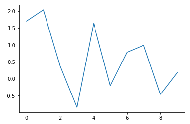

Hard-linked images
---

First we'll show a linked image. This has the following relative file path:

`{{ site.url }}/images/course-materials/earth-analytics/week-2/week2-data.png`

And is shown here:


The path above *will not* be changed when we run `nbconvert`.

If we want to edit the path upon building the site so that it becomes:

`{{ site.url }}/images/course-materials/...`

could do something like:


```python
import nbformat as nb
```


```python
ntbk = nb.read('./image_demo.ipynb', nb.NO_CONVERT)
```


```python
import os

# Path to the site root
SITE_ROOT = "/Users/choldgraf/Dropbox/github/forks/python/earth-analytics-python"

# Path relative to root for the notebook
rel_path = os.path.relpath(SITE_ROOT, '../../../../images/course-materials/earth-analytics/week-2/week2-data.png')

# Here's the text within a cell
hard_coded_path = 'some text\n\nsome more text'
print("---------\nORIGINAL\n", hard_coded_path)

# This would then replace the path
print("---------\nMODIFIED\n", hard_coded_path.replace(rel_path[:-2], "{{ site.url }}%s" %os.sep))
```

    ---------
    ORIGINAL
     some text
    
    some more text
    ---------
    MODIFIED
     some text
    
    some more text


MPL-generated images
---
Next we'll show off a plot that is *created* in the notebook by Matplotlib:


```python
import numpy as np
from matplotlib import pyplot as plt
plt.ion()
plt.plot(np.random.randn(10))
```


    [<matplotlib.lines.Line2D at 0x112f25438>]





The plot above will be automatically moved to the `images` folder we give `nbconvert`, and the path in the final `md` file will be relative (and should work on the website)


```python

```
