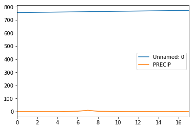
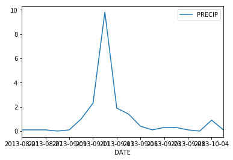



In this tutorial, we will explore the basic syntax (structure) or the `Python` programming
language. We will introduce assignment operators (`=`), comments (`#`) and functions
as used in `Python`. 

<div class='notice--success' markdown="1">

## <i class="fa fa-graduation-cap" aria-hidden="true"></i> Learning Objectives
At the end of this activity, you will be able to:

* Describe what a function is and how it is used in scientific programming
* Use functions in python including os.chdir() to set your working directory.
* Use the assignment operator in Python (`=`) to create a new variable or object.

## <i class="fa fa-check-square-o fa-2" aria-hidden="true"></i> What you need

You need `Python 3.x` and `Jupyter notebooks` to complete this tutorial. Also you should have
an `earth-analytics` directory setup on your computer with a `/data`
directory with it.

* [How to Setup R / RStudio](/course-materials/earth-analytics-python/week-1/setup-r-rstudio/)
* [Setup your working directory](/course-materials/earth-analytics-python/week-1/setup-working-directory/)
* [Intro to the R & RStudio Interface](/course-materials/earth-analytics-python/week-1/intro-to-r-and-rstudio)

</div>

[Last week](/course-materials/earth-analytics-python/week-1/), we
setup `Jupyter notebook` and `python` by installing the Anaconda distribution. We also got to know the 
`Jupyter notebook` interface. Finally, we created a basic
`Jupyter notebook` report by exporting the contents of a notebook to `html`. In this 
module, we will explore the basic
syntax of the `Python` programming language. We will learn how to:

1. import and work with python libraries and associated functions
2. work with vector objects in `python` and
3. import data into a pandas `data.frame` which is the `python` equivalent of a spreadsheet.

Let's start by considering at the code we used last week. In the code that we used last week we

1. Downloaded some data from figshare using the `urllib.request.urlretrieve` function which is a part of the `urllib` library that comes with python 3.x .
2. Imported the data into r using the `pd.read_csv()` function
3. Plotted the data using the `.plot()` function (which is a part of the `pandas` library and utilizes matplotlib plotting)

We used the following libraries to perform these tasks:

* pandas
* urllib
* os (used to ensure our working directory was correct).


```python
# can we please 
import pandas as pd
import numpy as np
import urllib
import os
# Force notebooks to plot figures inline (in the notebook)
plt.ion()
# download file from Earth Lab figshare repository
urllib.request.urlretrieve(url='https://ndownloader.figshare.com/files/7010681', 
                           filename= 'data/boulder-precip.csv')
# open data
data = pd.read_csv('data/boulder-precip.csv')
data.plot(x='DATE', 
          y='PRECIP')
```

In this lesson we will walk through the code that we used last week to create our first plot. We will also use functions in the numpy library - a library that is commonly used in python to support mathametical operations. 

## Explore our code
Let's take a few minutes to explore the code above to better understand what each part does. To begin, we set our working directory. 

We use the `.chdir()` function from the `os` library to set the working directory in python. Set your working directory to the earth-analytics directory that you created last week. Your path should look something like this:

`/Users/your-user-name/Documents/earth-analytics/`

`os.getcwd()` can be used to check your current working directory. 


```python
# be sure to set your working directory\n",
os.chdir("/Users/lewa8222/Documents/earth-analytics/")
```
Once we have changed our working directory, we can check it too using `os.getcwd()`. 


```python
# check to ensure your working directory is set properly
os.getcwd()
```


    '/Users/lewa8222/Documents/earth-analytics'


Next we load the required libraries. If you remember from the [week 1 homework, ]({{ site.url }}/course-materials/earth-analytics-python/week-1/install-r-packages/) libraries contain sets of tools, known as functions that perform commonly done tasks. For instance. the chdir() function in the OS library allows you to set the working directory that you want to work in. In order to use the chdir() function, you need to load the os library using the syntax

`import os`

which tells python to import all of the functions from the os library. 

Important: remember that we are loading all of our libraries at the TOP of our code. This ensures that someone else looking at the code knows exactly what libraries they need to have installed BEFORE running your code! 


```python
# load libraries
import pandas as pd
import numpy as np
import urllib
import os
```

## Plots in Jupyter notebooks

Plots don't render by default inline or on the screen where your code is in Python. To ensure that plots render in a Jypter notebook rather than in a separate python window which is the default, we use the function: 

`plt.ion()`


```python
# Force notebooks to plot figures inline (in the notebook)
plt.ion()
```

## Download data from a website

Once we have called all of the required libraries, we downloaded a file from figshare. 
We used the `urllib.request.urlretrieve` function to download data into the data/ directory within our earth-analytics working directory. 

Notice that this **function** has two arguments

1. **url=** the url where our data is located online
2. **filename=** the location and name of the file that we are downloading. Here we downloaded the data to data/boulder-precip.csv. Thus the file will be called boulder-precip.csv and it will be located in the data directory of our working directory.

NOTE: this download won't work if the `data/` directory doesn't already exist! 


```python
#db = et.EarthlabData()
# download file from Earth Lab figshare repository
urllib.request.urlretrieve(url='https://ndownloader.figshare.com/files/7010681', 
                           filename= 'data/boulder-precip.csv')
```


    ('data/boulder-precip.csv', <http.client.HTTPMessage at 0x1186c06d8>)


If the data downloaded correctly, you will recieve a message from python 

`('data/boulder-precip.csv', <http.client.HTTPMessage at 0x1186c06d8>)` confirming that the data were downloaded.

## Open data in python

Next, we opened the data in python. To open a .csv file in Python, we use the `read_csv()` function from the `pandas` library. 


```python
# open data
data = pd.read_csv('data/boulder-precip.csv')
```


### Explore tabular data in python

In python / pandas we can access 'columns' in our data using the syntax:

`['column-name-here']`

By adding `.head()` to the command we tell python to only return the first 6 rows of the DATE column. 


```python
# view the entire column (all rows) 
data['DATE'] 
```


    0     2013-08-21
    1     2013-08-26
    2     2013-08-27
    3     2013-09-01
    4     2013-09-09
    5     2013-09-10
    6     2013-09-11
    7     2013-09-12
    8     2013-09-13
    9     2013-09-15
    10    2013-09-16
    11    2013-09-22
    12    2013-09-23
    13    2013-09-27
    14    2013-09-28
    15    2013-10-01
    16    2013-10-04
    17    2013-10-11
    Name: DATE, dtype: object


```python
# view the first 6 rows of data in the DATE column
data['DATE'].head()
```


    0    2013-08-21
    1    2013-08-26
    2    2013-08-27
    3    2013-09-01
    4    2013-09-09
    Name: DATE, dtype: object


```python
# view first 6 lines of the entire data frame
data.head()
```


<div>
<table border="1" class="dataframe">
  <thead>
    <tr style="text-align: right;">
      <th></th>
      <th>Unnamed: 0</th>
      <th>DATE</th>
      <th>PRECIP</th>
    </tr>
  </thead>
  <tbody>
    <tr>
      <th>0</th>
      <td>756</td>
      <td>2013-08-21</td>
      <td>0.1</td>
    </tr>
    <tr>
      <th>1</th>
      <td>757</td>
      <td>2013-08-26</td>
      <td>0.1</td>
    </tr>
    <tr>
      <th>2</th>
      <td>758</td>
      <td>2013-08-27</td>
      <td>0.1</td>
    </tr>
    <tr>
      <th>3</th>
      <td>759</td>
      <td>2013-09-01</td>
      <td>0.0</td>
    </tr>
    <tr>
      <th>4</th>
      <td>760</td>
      <td>2013-09-09</td>
      <td>0.1</td>
    </tr>
  </tbody>
</table>
</div>


We can view the structure or type of data in each column using the dtypes attribute. 
Notice below that our data have 2 columns. One is of type object and the other is a numeric type - float64. 


```python
# view the structure of the data 
data.dtypes
```


    DATE       object
    PRECIP    float64
    dtype: object


Finally, we can create a quick plot of the data using `.plot`. 


```python
data.plot(x='DATE', 
          y='PRECIP')
```


    <matplotlib.axes._subplots.AxesSubplot at 0x11edf5630>


Notice that the plot above doesn't look exactly the way we may want it to look. We'll learn how to further customize plots in a later lesson. 

## About code syntax

The code above, uses syntax that is unique the `Python` programming language.

Syntax represents the characters or commands that `Python` understands and associated
organization / format of the code including spacing and comments. So, for example if you've used the `R` programming language before then you know that assignment operators in R use `<-` rather than the equals `=` sign. 

Let's break down the syntax of the python code above, to better understand what it's doing.

## Intro to the Python Syntax

### Assignment operator =

First, notice the use of `=`. `=` is the assignment operator. It is similar to
the `<-` sign in `R`. The equals sign assigns values on the right to objects on the left. So, after executing `x = 3`, the
value of `x` is `3` (`x=3`). The arrow can be read as 3 **goes into** `x`.

In the example below, we assigned the data file that we read into Python named `boulder-precip.csv`
to the variable name `boulder_precip`. After you run the line of code below,
what happens in Python?


```python
data = pd.read_csv('data/boulder-precip.csv')
data
```


<div>
<table border="1" class="dataframe">
  <thead>
    <tr style="text-align: right;">
      <th></th>
      <th>Unnamed: 0</th>
      <th>DATE</th>
      <th>PRECIP</th>
    </tr>
  </thead>
  <tbody>
    <tr>
      <th>0</th>
      <td>756</td>
      <td>2013-08-21</td>
      <td>0.1</td>
    </tr>
    <tr>
      <th>1</th>
      <td>757</td>
      <td>2013-08-26</td>
      <td>0.1</td>
    </tr>
    <tr>
      <th>2</th>
      <td>758</td>
      <td>2013-08-27</td>
      <td>0.1</td>
    </tr>
    <tr>
      <th>3</th>
      <td>759</td>
      <td>2013-09-01</td>
      <td>0.0</td>
    </tr>
    <tr>
      <th>4</th>
      <td>760</td>
      <td>2013-09-09</td>
      <td>0.1</td>
    </tr>
    <tr>
      <th>5</th>
      <td>761</td>
      <td>2013-09-10</td>
      <td>1.0</td>
    </tr>
    <tr>
      <th>6</th>
      <td>762</td>
      <td>2013-09-11</td>
      <td>2.3</td>
    </tr>
    <tr>
      <th>7</th>
      <td>763</td>
      <td>2013-09-12</td>
      <td>9.8</td>
    </tr>
    <tr>
      <th>8</th>
      <td>764</td>
      <td>2013-09-13</td>
      <td>1.9</td>
    </tr>
    <tr>
      <th>9</th>
      <td>765</td>
      <td>2013-09-15</td>
      <td>1.4</td>
    </tr>
    <tr>
      <th>10</th>
      <td>766</td>
      <td>2013-09-16</td>
      <td>0.4</td>
    </tr>
    <tr>
      <th>11</th>
      <td>767</td>
      <td>2013-09-22</td>
      <td>0.1</td>
    </tr>
    <tr>
      <th>12</th>
      <td>768</td>
      <td>2013-09-23</td>
      <td>0.3</td>
    </tr>
    <tr>
      <th>13</th>
      <td>769</td>
      <td>2013-09-27</td>
      <td>0.3</td>
    </tr>
    <tr>
      <th>14</th>
      <td>770</td>
      <td>2013-09-28</td>
      <td>0.1</td>
    </tr>
    <tr>
      <th>15</th>
      <td>771</td>
      <td>2013-10-01</td>
      <td>0.0</td>
    </tr>
    <tr>
      <th>16</th>
      <td>772</td>
      <td>2013-10-04</td>
      <td>0.9</td>
    </tr>
    <tr>
      <th>17</th>
      <td>773</td>
      <td>2013-10-11</td>
      <td>0.1</td>
    </tr>
  </tbody>
</table>
</div>


<i class="fa fa-star"></i> **Data Tip:**  In Jupyter notebooks, typing <kbd>Esc</kbd> + <kbd>A</kbd> at the
same time will write add a new cell AFTER the cell that you're currently working in.  Similarly, typing <kbd>Esc</kbd> + <kbd>B</kbd> at the
same time will write add a new cell AFTER the cell that you're currently working in. Hint: B is for BEFORE and A is for AFTER.
{: .notice--success}


### Comments in Python (`#`)

Next, notice the use of the `#` sign in our code example above.
Use `#` sign is used to add comments to your code. A comment is a line of information
in your code that is not executed by R. Anything to the right of a `#` is ignored
by `Python`. Comments are a way for you
to DOCUMENT the steps of your code - both for yourself and for others who may
use your script.


```python
# this is a comment. Python will not try to run this line
# comments are useful when we want to document the steps in our code

```

### Functions and their arguments

Finally we have functions. Functions are "canned scripts" that automate a task
that may other take several lines of code that you have to type in.

For example:


```python
# calculate the square root of 16
np.sqrt(16)
```


    4.0


```python
np.round(16.345)

```


    16.0


In the example above, the `sqrt` function is built into `python` and takes the square
root of any number that you provide to it. Similarly the `round()` function can be used to round numbers.

### Functions that return values
The  `sqrt()` function is a numpy function. The input (the
argument) is a number, and the return value (the output)
is the square root of that number. Executing a function ('running it') is called
*calling* the function. An example of a function call is:

`b <- np.sqrt(a)`

Here, the value of `a` is given to the `np.sqrt()` function, the `np.sqrt()` function
calculates the square root, and returns the value which is then assigned to
variable `b`. This function is very simple, because it takes just one argument.

Let's run a function that can take multiple arguments: `np.round()`.

### Function arguments

An argument is a specified input to a function. This inpus needs to be in a particular format for the function to run properly. For instance, the round function requires a NUMERIC input. We can round for instance the letter A!


```python
np.round(a=3.14159)
```

Here, we've called `round()` with just one argument, `3.14159`, and it has
returned the value `3`.  That's because the default is to round to the nearest
whole number. If we want more digits we can see how to do that by getting
information about the `round` function.  We can use `help(round)` to look at the
help for this function using `?round`.

# what's the easiest way to get a function documentation in jupyter?
# what does the cell below do? is there a quick way to see all of the arguments available for a function and the methods /attributes available for an object?


```python
# view documentation for the round() function in python
help(np.round)
```

    Help on function round_ in module numpy.core.fromnumeric:
    
    round_(a, decimals=0, out=None)
        Round an array to the given number of decimals.
        
        Refer to `around` for full documentation.
        
        See Also
        --------
        around : equivalent function
    


### hello tab complete!

We can also use tab complete to discover arguments. For instance type
np.round(<tab-here> so see the arguments that are available for the round function in numpy. 

Note above that we see there is a **decimals** argument that we can add to our round function that will specify the number of decimal places that the function returns. If we specify `decimals=3` then python will round the data to 3 decimal points. 

# why does 3 return so many decimal places??!! 2 works but nothing else


```python
# what does this argument value return?
np.round(3.23457457, 
         decimals=3)

```


    3.2349999999999999


```python
np.round(3.14159, 
         decimals=1)
```


    3.1000000000000001


If we provide the arguments in the exact same order as they are defined in the function documentation, then you don't have to explicetly call the argument name: 


```python
np.round(3.14159, 2)
```


    3.1400000000000001


```python
# but what happens here?
np.round(2, 3.14159)

```


    ---------------------------------------------------------------------------

    AttributeError                            Traceback (most recent call last)

    /Users/lewa8222/anaconda/lib/python3.6/site-packages/numpy/core/fromnumeric.py in _wrapfunc(obj, method, *args, **kwds)
         56     try:
    ---> 57         return getattr(obj, method)(*args, **kwds)
         58 


    AttributeError: 'int' object has no attribute 'round'

    
    During handling of the above exception, another exception occurred:


    TypeError                                 Traceback (most recent call last)

    <ipython-input-37-e54a09d8d9f3> in <module>()
    ----> 1 np.round(2, 3.14159)
    

    /Users/lewa8222/anaconda/lib/python3.6/site-packages/numpy/core/fromnumeric.py in round_(a, decimals, out)
       2781 
       2782     """
    -> 2783     return around(a, decimals=decimals, out=out)
       2784 
       2785 


    /Users/lewa8222/anaconda/lib/python3.6/site-packages/numpy/core/fromnumeric.py in around(a, decimals, out)
       2767 
       2768     """
    -> 2769     return _wrapfunc(a, 'round', decimals=decimals, out=out)
       2770 
       2771 


    /Users/lewa8222/anaconda/lib/python3.6/site-packages/numpy/core/fromnumeric.py in _wrapfunc(obj, method, *args, **kwds)
         65     # a downstream library like 'pandas'.
         66     except (AttributeError, TypeError):
    ---> 67         return _wrapit(obj, method, *args, **kwds)
         68 
         69 


    /Users/lewa8222/anaconda/lib/python3.6/site-packages/numpy/core/fromnumeric.py in _wrapit(obj, method, *args, **kwds)
         45     except AttributeError:
         46         wrap = None
    ---> 47     result = getattr(asarray(obj), method)(*args, **kwds)
         48     if wrap:
         49         if not isinstance(result, mu.ndarray):


    TypeError: integer argument expected, got float


Notice above python returned an error. At the very bottom of the error notice:
`TypeError: integer argument expected, got float`. Why do you think this happened?

Notice that we provided the arguments as follows:

`np.round(2, 3.14159)`

Python tried to round the value 2 to 3.14159 which is a decimal rather than an integer value. 

However, if we explicetly name each argument and assign it it's appropriate value, then we can switch the order:


```python
np.round(decimals=2, a=3.14159)
```


    3.1400000000000001


### The plot function

Below, we use the `.plot()` function which is a part of the `pandas` library to plot our data.
`.plot()` needs two arguments to execute properly:

1. The value that you want to plot on the `x=` axis and
2. The value that you want to plot on the `y=` axis

Note below that if we don't tell python what to plot on the x and y axis it tries to 
guess which variables to plot on which axis. This isn't quite what we want


```python
# what happens if we plot without any arguments?
data.plot()
```


    <matplotlib.axes._subplots.AxesSubplot at 0x111d168d0>





```python
# what happens if we plot with the x and y arguments?
data.plot(x='DATE', 
         y='PRECIP')
```


    <matplotlib.axes._subplots.AxesSubplot at 0x11ed75908>





### Base functions vs. packages
There are a
set of functions that come with `Python 3.x` when you download it. These are called `base Python`
functions. Other functions are add-ons to base `Python`. These functions can be loaded by

1. Installing a particular library (using conda install library-name at the command line
2. Loading the library in our script using `import library as nickname` eg: import pandas as pd 

We can also write our own functions. We will learn how to write functions later in this course. 

### Function outputs
Functions return an output. Sometimes that output is a *figure* like the example
above. Sometimes it is a *value* or a set of values or even something else.

It's good practice to put the non-optional arguments (like the number you're
rounding) first in your function call, and to specify the names of all optional
arguments.  If you don't, someone reading your code might have to look up
definition of a function with unfamiliar arguments to understand what you're
doing.

## Get Information About A Function

If you need help with a specific function, let's say `barplot()`, you can type:


```python
import matplotlib.pyplot as plt
```


```python
plt.bar?
```


```python
# plt.bar<tab>
```

<div class="notice--warning" markdown="1">

## <i class="fa fa-pencil-square-o" aria-hidden="true"></i> Optional challenge activity

Use the `RMarkdown` document that we created as homework for today's class. If
you don't have a document already, create a new one, naming it: "lastname-firstname-wk2.Rmd.
Add the code below in a code chunk. Edit the code that you just pasted into
your `.Rmd` document as follows

1. The plot isn't pretty. Let's fix the x and y labels.
Look up the arguments for the `qplot()` function using either args(qplot) OR `?qplot`
in the R console. Then fix the labels of your plot in your script.

HINT: google is your friend. Feel free to use it to help edit the code.

2. What other things can you modify to make the plot look prettier. Explore. Are
there things that you'd like to do that you can't?
</div>

# notice the code below needs to be the answer to the challenge above 
<!--


# load libraries 
library(ggplot2)

# download data from figshare
# note that we are downloaded the data into your
download.file(url = "https://ndownloader.figshare.com/files/7010681",
              destfile = "data/boulder-precip.csv")

# import data
boulder_precip <- read.csv(file="data/boulder-precip.csv")

# view first few rows of the data
head(boulder_precip)

# when we download the data we create a dataframe
# view each column of the data frame using it's name (or header)
boulder_precip$DATE

# view the precip column
boulder_precip$PRECIP

# q plot stands for quick plot. Let's use it to plot our data
qplot(x=boulder_precip$DATE,
      y=boulder_precip$PRECIP)

-->
