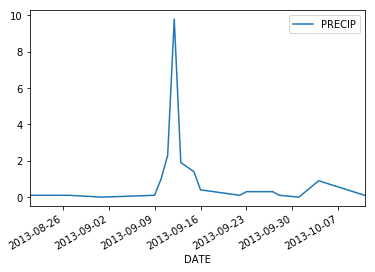
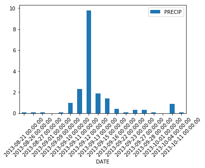
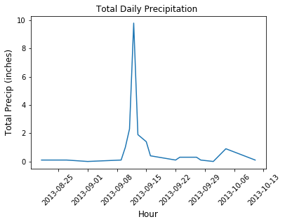



This lesson introduces the data.frame which is very similar to working with
a spreadsheet in `Python`.

<div class='notice--success' markdown="1">

## <i class="fa fa-graduation-cap" aria-hidden="true"></i> Learning Objectives
At the end of this activity, you will be able to:

* Open .csv or text file containing tabular (spreadsheet) formatted data in Python.
* Quickly plot the data using the GGPLOT2 function qplot()

## <i class="fa fa-check-square-o fa-2" aria-hidden="true"></i> What you need

You need R and RStudio to complete this tutorial. Also we recommend have you
have an `earth-analytics` directory setup on your computer with a `/data`
directory with it.

* [How to Setup R / R Studio](/course-materials/earth-analytics/week-1/setup-r-rstudio/)
* [Setup your working directory](/course-materials/earth-analytics/week-1/setup-working-directory/)


</div>

In the homework from week 1, we used the code below to create a report with `knitr`
in `RStudio`.


```python
#import earthlab as et
# import python libraries
import numpy as np
import pandas as pd
import urllib
import os
from matplotlib import pyplot as plt

# Force notebooks to plot figures inline (in the notebook)
plt.ion()

# be sure to set your working directory 
os.chdir("/Users/lewa8222/Documents/earth-analytics/")
os.getcwd()
```


    '/Users/lewa8222/Documents/earth-analytics'


```python
#paths = et.data.get_data('week_02')
#print(paths)
```


```python
# download data from figshare (note - we did this in a previous lesson)
urllib.request.urlretrieve(url='https://ndownloader.figshare.com/files/7010681', 
                           filename= 'data/boulder-precip.csv')
```


    ('data/boulder-precip.csv', <http.client.HTTPMessage at 0x119d863c8>)


Let's break the code above down. First, we use the `urllib.request.urlretrieve()` function to
download a datafile. In this case, the data are housed on
<a href="http://www.figshare.com" target="_blank">Figshare</a> - a
popular data repository that is free to use if your data are cumulatively
smaller than 20gb.

Notice that `urllib.request.urlretrieve()` function has two **ARGUMENTS**:

1. **url**: this is the path to the data file that you wish to download
2. **filename**: this is the location on your computer (in this case: `/data`) and name of the
file when saved (in this case: boulder-precip.csv). So we downloaded a file from
a url on figshare do our data directory. We named that file `boulder-precip.csv`.

Next, we read in the data using the function: `pd.read_csv()`.


```python
boulder_precip = pd.read_csv('data/boulder-precip.csv')
boulder_precip.head()
```


<div>
<table border="1" class="dataframe">
  <thead>
    <tr style="text-align: right;">
      <th></th>
      <th>Unnamed: 0</th>
      <th>DATE</th>
      <th>PRECIP</th>
    </tr>
  </thead>
  <tbody>
    <tr>
      <th>0</th>
      <td>756</td>
      <td>2013-08-21</td>
      <td>0.1</td>
    </tr>
    <tr>
      <th>1</th>
      <td>757</td>
      <td>2013-08-26</td>
      <td>0.1</td>
    </tr>
    <tr>
      <th>2</th>
      <td>758</td>
      <td>2013-08-27</td>
      <td>0.1</td>
    </tr>
    <tr>
      <th>3</th>
      <td>759</td>
      <td>2013-09-01</td>
      <td>0.0</td>
    </tr>
    <tr>
      <th>4</th>
      <td>760</td>
      <td>2013-09-09</td>
      <td>0.1</td>
    </tr>
  </tbody>
</table>
</div>


```python
# view the structure of the data.frame 
boulder_precip.dtypes

```


    Unnamed: 0      int64
    DATE           object
    PRECIP        float64
    dtype: object


```python
# ```{r import-data }

# # import data

# boulder_precip <- read.csv(file="data/boulder-precip.csv")


# # view first few rows of the data

# head(boulder_precip)


# # view the format of the boulder_precip object in R

# str(boulder_precip)

# ```

```

<div class="notice--warning" markdown="1">


## <i class="fa fa-pencil-square-o" aria-hidden="true"></i> Challenge
What is the format associated with each column for the `boulder_precip`
data.frame? Describe the attributes of each format. Can you perform math
on each column? Why or why not?


<!--
integer - numbers without decimal points,
character: text strings
number: numeric values (can contain decimals places)
-->

</div>


## Introduction to the DataFrame

When we read data into Python using `pd.read_csv()` it imports it into a DataFrame format.
A DataFrame is a 2-dimensional data structure that can store data of different types (including characters, integers, floating point values and more) in columns. It is similar to a spreadsheet or an SQL database table. 

A dataframe is composed of columns and rows. Each column in a dataFrame object has the same number of rows.
Each cell in a dataframe is located or defined by a x,y (column, row) index value. 

Remember that in python, this index value begins at 0!  


A data frame can be created manually, however most commonly they are generated when
you important a text file or spreadsheet into Python using the Pandas function `pd.read_csv`.


## Extracting / Specifying "columns" By Name

We can extract one single column from a dataFrame using the syntax:

`data_frame_name['columnNameHere']`

as follows:


```python
# view the date column of the data frame using its name (or header)
boulder_precip['DATE']
```


    0     2013-08-21
    1     2013-08-26
    2     2013-08-27
    3     2013-09-01
    4     2013-09-09
    5     2013-09-10
    6     2013-09-11
    7     2013-09-12
    8     2013-09-13
    9     2013-09-15
    10    2013-09-16
    11    2013-09-22
    12    2013-09-23
    13    2013-09-27
    14    2013-09-28
    15    2013-10-01
    16    2013-10-04
    17    2013-10-11
    Name: DATE, dtype: object


```python
# view the precip column
boulder_precip['PRECIP']
```


    0     0.1
    1     0.1
    2     0.1
    3     0.0
    4     0.1
    5     1.0
    6     2.3
    7     9.8
    8     1.9
    9     1.4
    10    0.4
    11    0.1
    12    0.3
    13    0.3
    14    0.1
    15    0.0
    16    0.9
    17    0.1
    Name: PRECIP, dtype: float64


## View Structure of a Data Frame

We can explore the format of our data frame too. For instance, we can see how many rows and columns our dataframe has using the shape attribute. 


```python
# view the number of rows and columns in our dataframe
boulder_precip.shape
```


    (18, 3)


<div class="notice--warning" markdown="1">

## <i class="fa fa-pencil-square-o" aria-hidden="true"></i> 
## Optional challenge

Using our DataFrame surveys_df, try out the attributes & methods below to see what they return.

surveys_df.columns
surveys_df.shape Take note of the output of shape - what format does it return the shape of the DataFrame in?

HINT: More on tuples, here.
surveys_df.head() Also, what does surveys_df.head(15) do?
surveys_df.tail()

</div>


```python
# view the data structure of the data frame
boulder_precip.dtypes
```


    Unnamed: 0      int64
    DATE           object
    PRECIP        float64
    dtype: object


## Calculate dataframe statistics
We can quickly calculate summary statistics too.


```python
# view column names
boulder_precip.columns.values
```


    array(['Unnamed: 0', 'DATE', 'PRECIP'], dtype=object)


```python
# view summary statistics  - for all columns
boulder_precip.describe()
```


<div>
<table border="1" class="dataframe">
  <thead>
    <tr style="text-align: right;">
      <th></th>
      <th>Unnamed: 0</th>
      <th>PRECIP</th>
    </tr>
  </thead>
  <tbody>
    <tr>
      <th>count</th>
      <td>18.000000</td>
      <td>18.000000</td>
    </tr>
    <tr>
      <th>mean</th>
      <td>764.500000</td>
      <td>1.055556</td>
    </tr>
    <tr>
      <th>std</th>
      <td>5.338539</td>
      <td>2.288905</td>
    </tr>
    <tr>
      <th>min</th>
      <td>756.000000</td>
      <td>0.000000</td>
    </tr>
    <tr>
      <th>25%</th>
      <td>760.250000</td>
      <td>0.100000</td>
    </tr>
    <tr>
      <th>50%</th>
      <td>764.500000</td>
      <td>0.200000</td>
    </tr>
    <tr>
      <th>75%</th>
      <td>768.750000</td>
      <td>0.975000</td>
    </tr>
    <tr>
      <th>max</th>
      <td>773.000000</td>
      <td>9.800000</td>
    </tr>
  </tbody>
</table>
</div>


```python
# view summary statistics  - for just the precip column
boulder_precip['PRECIP'].describe()
```


    count    18.000000
    mean      1.055556
    std       2.288905
    min       0.000000
    25%       0.100000
    50%       0.200000
    75%       0.975000
    max       9.800000
    Name: PRECIP, dtype: float64


```python
# view a list of just the unique precipitation values
pd.unique(boulder_precip['PRECIP'])
```


    array([ 0.1,  0. ,  1. ,  2.3,  9.8,  1.9,  1.4,  0.4,  0.3,  0.9])


## Plot data

We can quickly plot our data too. Note that we are using the `.plot()` function.


```python
# setup the plot
boulder_precip.plot('DATE', 'PRECIP')
```


    <matplotlib.axes._subplots.AxesSubplot at 0x11ee2cf98>





```python
# create a barplot
ax = boulder_precip.plot('DATE', 'PRECIP', kind='bar')
# add labels to the plot on a 45 degree angle - this doesn't seem to be necessary 
plt.setp(ax.get_xticklabels(), rotation=45);
```





```python
# convert DATE field to a datetime structure
boulder_precip['DATE'] = pd.to_datetime(boulder_precip['DATE'])
boulder_precip.dtypes

```


    Unnamed: 0             int64
    DATE          datetime64[ns]
    PRECIP               float64
    dtype: object


Let's take a little time to customize our plots. Below we add the following arguments to our plot:

* title: add a title to your plot
* legend = False: turn off the legend for hte plot
* kind = bar: create a bar plot


```python
# here it seems that pandas understand dates?? does it by default?
fig, ax = plt.subplots()
ax.plot('DATE', 'PRECIP', data=boulder_precip)
ax.set_title("Total Daily Precipitation")

#ax = boulder_precip.plot('DATE', 'PRECIP', kind='bar')
ax.set_xlabel("Hour", fontsize=12)
ax.set_ylabel("Total Precip (inches)", fontsize=12)
#ax.plot('DATE', 'PRECIP', data=boulder_precip)
#ax.xaxis.set_major_locator(dates.MonthLocator())
plt.setp(ax.get_xticklabels(), rotation=45);
```




