

In this tutorial, we will explore more advanced plotting techniques using `matplotlib`.

<div class='notice--success' markdown="1">

## <i class="fa fa-graduation-cap" aria-hidden="true"></i> Learning Objectives

At the end of this activity, you will be able to:

* Use the `matplotlib` plot function to create custom plots.
* Add labels to x and y axes and a title to your matplotlib plot.
* Customize the colors and look of a matplotlib plot.

## <i class="fa fa-check-square-o fa-2" aria-hidden="true"></i> What you need

You need `Python 3.x` and `Jupyter notebooks` to complete this tutorial. Also you should have
an `earth-analytics` directory setup on your computer with a `/data`
directory with it.


* [How to Setup R / RStudio](/course-materials/earth-analytics/week-1/setup-r-rstudio/)
* [Setup your working directory](/course-materials/earth-analytics/week-1/setup-working-directory/)
* [Intro to the R & RStudio Interface](/course-materials/earth-analytics/week-1/intro-to-r-and-rstudio)

</div>

## Important - Data Organization
Before you begin this lesson series, be sure that you've downloaded the dataset above.
You will need to UNZIP the zip file. When you do this, be sure that your directory
looks like the image below: note that all of the data are within the week2
directory. They are not nested within another directory. You may have to copy and
paste your files to make this look right.

<figure>
<a href="{{ site.baseurl }}/images/course-materials/earth-analytics/week-2/week2-data.png">

</a>
<figcaption>Your `week2` file directory should look like the one above. Note that
the data directly under the week-2 folder.</figcaption>
</figure>

In our week 1 homework, we used the pandas plot function to plot our data.
In this tutorial, we'll explore more advanced plotting techniques using matplotlib.

Let's explore the code below to that was used to create a quick pandas plot.


```python
#import earthlab as et
import numpy as np
import pandas as pd
import matplotlib.pyplot as plt
import os
import urllib
plt.ion()
# what does this do??
plt.style.use('ggplot')
```


```python
# be sure to set your working directory\n",
os.chdir("/Users/lewa8222/Documents/earth-analytics/")

```


    '/Users/lewa8222/Documents/earth-analytics'


```python
# view all styles 
#print(plt.style.available)
```

    ['_classic_test', 'bmh', 'classic', 'dark_background', 'fivethirtyeight', 'ggplot', 'grayscale', 'seaborn-bright', 'seaborn-colorblind', 'seaborn-dark-palette', 'seaborn-dark', 'seaborn-darkgrid', 'seaborn-deep', 'seaborn-muted', 'seaborn-notebook', 'seaborn-paper', 'seaborn-pastel', 'seaborn-poster', 'seaborn-talk', 'seaborn-ticks', 'seaborn-white', 'seaborn-whitegrid', 'seaborn']


In the previous lessons we downloaded and imported data from figshare into Python using the following code.


```python
# download file from Earth Lab figshare repository
urllib.request.urlretrieve(url='https://ndownloader.figshare.com/files/7010681', 
                           filename= 'data/boulder-precip.csv')

# is parse dates a function argument that recoganizes dates? we didn't use this earlier. 
boulder_precip = pd.read_csv('data/boulder-precip.csv', 
                             index_col=0, 
                             parse_dates=['DATE'])

# view first few rows of data
boulder_precip.head()
```

Then we plotted the data using the pandas function, `.plot()`.


```python
# is this pandas plotting or matplotlib plotting
boulder_precip.plot('DATE', 'PRECIP')
```


    <matplotlib.axes._subplots.AxesSubplot at 0x10f4cc320>


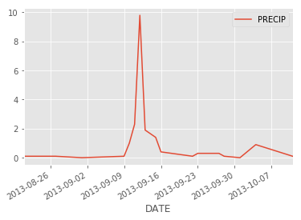


## Plot with matplotlib

`Matplotlib` is a plotting package that makes it simple to create complex plots
from data in a data.frame. It uses default settings, which help to create
publication quality plots with a minimal amount of settings and tweaking.
Matplotlib graphics are built step by step by adding new elements.

To build a matplotlib plot we need to:

1. define the axes 


```python
# first create the plot space upon which to plot the data
fig, ax = plt.subplots()
```


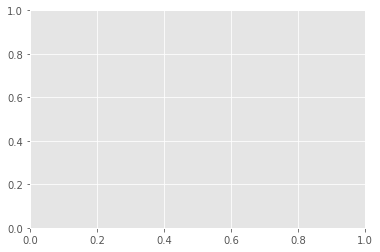


2. Define the plot elements including the x and y variables and the data to be used

`ax.plot('DATE', 'PRECIP', data=boulder_precip)`


```python
fig, ax = plt.subplots()
ax.plot('DATE', 'PRECIP', data=boulder_precip)

```


    [<matplotlib.lines.Line2D at 0x113147c88>]


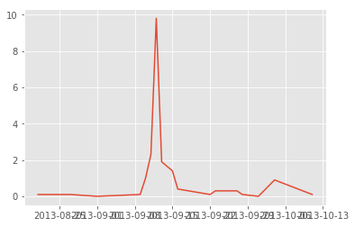


Then finally we can refine our plot adding labels and other elements. 


```python
# define figure
fig, ax = plt.subplots()
# Define data and x and y axes
ax.plot('DATE', 'PRECIP', data=boulder_precip)
# set plot title
ax.set(title="matplotlib example plot precip")
plt.setp(ax.get_xticklabels(), rotation=45);
```


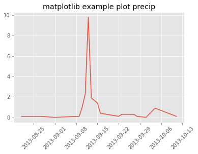


We can customize the look of the plot in different ways. For instance below we change the point marker type to a circle using the function argument:  `-o`.

Visit the <a href="http://matplotlib.org/1.4.1/api/markers_api.html" target="_blank">Matplotlib documentation </a> for a list of marker types. 

|Marker symbol| Marker description
|---|---|
| . | 	point |
| , |	pixel |
| o |	circle|
| v | 	triangle_down|
| ^ | 	triangle_up |
| < |	triangle_left|
| > | 	triangle_right |


```python
fig, ax = plt.subplots()
# why does this fail when i add the argument names for x and y
ax.plot('DATE','PRECIP', '-o', data=boulder_precip)
ax.set(title="matplotlib example plot precip")
plt.setp(ax.get_xticklabels(), rotation=45);
```


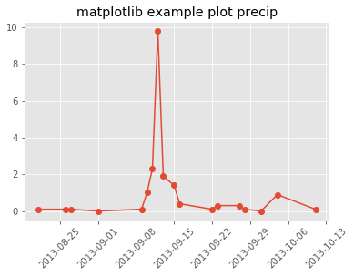


```python
# Here i want to turn this into a bar plot

```

## Subset by date 

We can use pandas to subset our data, if ywe want to create a plot ...

# not sure exactly what this is doing here or  what the notes mean about providing values directly to the functions. 
# why use ax.scatter vs ax.plot -- what is the difference?


```python
# This would just be a combination of calls to `ax.scatter` `ax.plot` etc
# Could show here that you can also give the values directly to the plotting functions, e.g.:
```


```python
dates = pd.date_range(pd.datetime(2016, 1, 1), pd.datetime(2016, 1, 2), freq='H')
dates = pd.DataFrame(dates, columns=['date'])
```


```python
boulder_precip['DATE'].index
```


    Int64Index([756, 757, 758, 759, 760, 761, 762, 763, 764, 765, 766, 767, 768,
                769, 770, 771, 772, 773],
               dtype='int64')


```python
fig, ax = plt.subplots()
ax.scatter(boulder_precip['DATE'].values, boulder_precip['PRECIP'].values)
plt.setp(ax.get_xticklabels(), rotation=45);
```


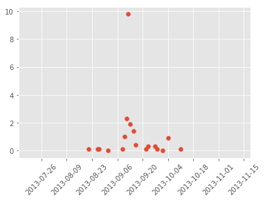


## Change point colors

We can also apply a color to our points using the `c=` argument. Below we set the points to blue using `c='blue'`

Here is a few colors to get your started.

        b: blue
        g: green
        r: red
        c: cyan
        m: magenta
        y: yellow
        k: black
        w: white

More about matplotlib colors
https://matplotlib.org/api/colors_api.html


```python
fig, ax = plt.subplots()
ax.scatter(boulder_precip['DATE'].values, boulder_precip['PRECIP'].values,
           c='blue')
plt.setp(ax.get_xticklabels(), rotation=45);
```


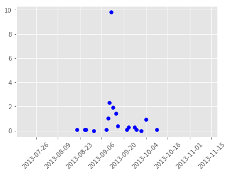


We can adjust the transparency using the `alpha=` argument.


```python
fig, ax = plt.subplots()
ax.scatter(boulder_precip['DATE'].values, 
           boulder_precip['PRECIP'].values,
           c='blue', alpha=.5)
plt.setp(ax.get_xticklabels(), rotation=45);
```


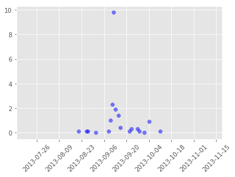


Or to color each value in the plot differently according to a value in the data by first setting the color argument, c to the column of interest in the data.frame. 

`c=boulder_precip['PRECIP'].values`

and then specifying colors using the cmap argument.

`cmap='rainbow'`


```python
# setup figure
fig, ax = plt.subplots()
# create scatterplot
ax.scatter(boulder_precip['DATE'].values, 
           boulder_precip['PRECIP'].values,
           c=boulder_precip['PRECIP'].values, 
           alpha=.5, cmap='rainbow')
# adjust x axis labels
plt.setp(ax.get_xticklabels(), rotation=45);
```


### Bar plots

We can turn our plot into a bar plot using `ax.bar()`.


```python
# why do we use .values here?
fig, ax = plt.subplots()
ax.bar(boulder_precip['DATE'].values, boulder_precip['PRECIP'].values)
plt.setp(ax.get_xticklabels(), rotation=45);
```


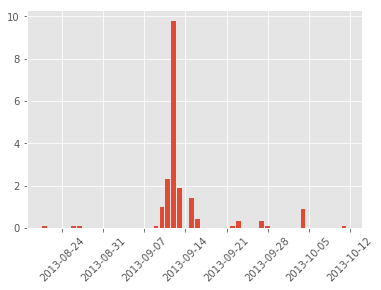


Turn the bar outlines blue


```python
fig, ax = plt.subplots()
ax.bar(boulder_precip['DATE'].values, boulder_precip['PRECIP'].values,
       edgecolor='blue')
plt.setp(ax.get_xticklabels(), rotation=45);
```


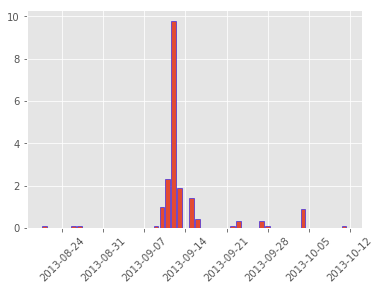


```python
# ```{r bar-color, purl=FALSE, fig.cap="ggplot with blue bars"}

# ggplot(data = boulder_precip,  aes(x = DATE, y = PRECIP)) +

#     geom_bar(stat="identity", color="blue")


# ```

```


Change the fill to bright green.


```python
fig, ax = plt.subplots()
ax.bar(boulder_precip['DATE'].values, boulder_precip['PRECIP'].values,
       edgecolor='blue', color='green')
plt.setp(ax.get_xticklabels(), rotation=45);
```


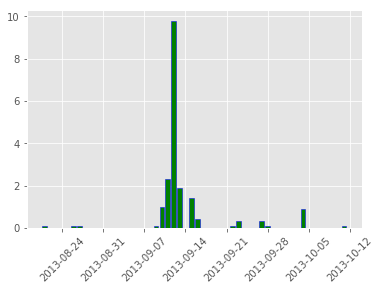


## Add plot labels


You can add labels to your plots as well. Let's add a title, and x and y labels using the `xlabel` and `ylabel` arguments within the `ax.set()` function.


```python
fig, ax = plt.subplots()
ax.bar(boulder_precip['DATE'].values, boulder_precip['PRECIP'].values,
       edgecolor='blue')
plt.setp(ax.get_xticklabels(), rotation=45);
ax.set(xlabel="Date", ylabel="Precipitation (Inches)", title="Daily Precipitation (inches)\nBoulder, Colorado 2013");
```


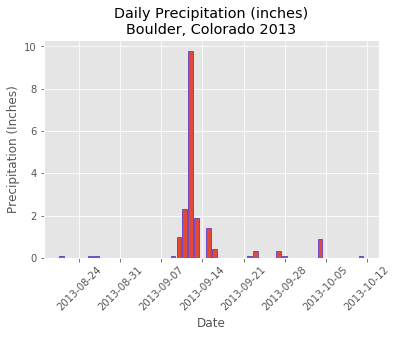


```python
# how would i format dates? to  - for example remove the year
```
