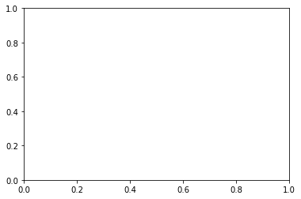




## Get started with date formats in Python

In this tutorial, we will look at the date time format - which is important for
plotting and working with time series data in R.


<div class='notice--success' markdown="1">

## <i class="fa fa-graduation-cap" aria-hidden="true"></i> Learning Objectives

At the end of this activity, you will be able to:

* Convert column in a dataframe containing dates / times to a date/time object that can be used in Python.
* Be able to describe how we can use the 'date' class to create easier to read time series plots in `Python`.


## <i class="fa fa-check-square-o fa-2" aria-hidden="true"></i> What you need

You need `Python 3.x` and `Jupyter notebooks` to complete this tutorial. Also you should have
an `earth-analytics` directory setup on your computer with a `/data`
directory with it.

* [How to Setup R / RStudio](/course-materials/earth-analytics/week-1/setup-r-rstudio/)
* [Setup your working directory](/course-materials/earth-analytics/week-1/setup-working-directory/)
* [Intro to the R & RStudio Interface](/course-materials/earth-analytics/week-1/intro-to-r-and-rstudio)

</div>


In this tutorial, we will learn how to convert data that contain dates and times
into a date / time format in `Python`. To begin, let's revisit the boulder precip data that we've been working with in this module.


```python
#import earthlab as et
import numpy as np
import pandas as pd
import matplotlib.pyplot as plt
import os
plt.ion()
```


```python
# be sure to set your working directory\n",
os.chdir("/Users/lewa8222/Documents/earth-analytics/")
# check to ensure your working directory is set properly
os.getcwd()
```


    '/Users/lewa8222/Documents/earth-analytics'


## Plot using pandas 


```python
boulder_precip = pd.read_csv('data/boulder-precip.csv')
boulder_precip.plot('DATE', 'PRECIP')
```


    <matplotlib.axes._subplots.AxesSubplot at 0x11a702668>


## Plot using matplotlib

We know how to use `matplotlib` rather than pandas plot() so let's use that instead.

## how does it know to use the dates??


```python
fig, ax= plt.subplots()
ax.plot('DATE', 'PRECIP', data=boulder_precip)
plt.setp(ax.get_xticklabels(), rotation=45)
ax.set(xlabel="Date",
       ylabel="Total Precipitation (Inches)",
       title="Precipitation Data\nBoulder, Colorado 2013");
```


    ---------------------------------------------------------------------------

    ValueError                                Traceback (most recent call last)

    <ipython-input-12-07bdf32f1a38> in <module>()
          1 fig, ax= plt.subplots()
    ----> 2 ax.plot('DATE', 'PRECIP', data=boulder_precip)
          3 plt.setp(ax.get_xticklabels(), rotation=45)
          4 ax.set(xlabel="Date",
          5        ylabel="Total Precipitation (Inches)",


    /Users/lewa8222/anaconda/lib/python3.6/site-packages/matplotlib/__init__.py in inner(ax, *args, **kwargs)
       1896                     warnings.warn(msg % (label_namer, func.__name__),
       1897                                   RuntimeWarning, stacklevel=2)
    -> 1898             return func(ax, *args, **kwargs)
       1899         pre_doc = inner.__doc__
       1900         if pre_doc is None:


    /Users/lewa8222/anaconda/lib/python3.6/site-packages/matplotlib/axes/_axes.py in plot(self, *args, **kwargs)
       1405 
       1406         for line in self._get_lines(*args, **kwargs):
    -> 1407             self.add_line(line)
       1408             lines.append(line)
       1409 


    /Users/lewa8222/anaconda/lib/python3.6/site-packages/matplotlib/axes/_base.py in add_line(self, line)
       1791             line.set_clip_path(self.patch)
       1792 
    -> 1793         self._update_line_limits(line)
       1794         if not line.get_label():
       1795             line.set_label('_line%d' % len(self.lines))


    /Users/lewa8222/anaconda/lib/python3.6/site-packages/matplotlib/axes/_base.py in _update_line_limits(self, line)
       1813         Figures out the data limit of the given line, updating self.dataLim.
       1814         """
    -> 1815         path = line.get_path()
       1816         if path.vertices.size == 0:
       1817             return


    /Users/lewa8222/anaconda/lib/python3.6/site-packages/matplotlib/lines.py in get_path(self)
        987         """
        988         if self._invalidy or self._invalidx:
    --> 989             self.recache()
        990         return self._path
        991 


    /Users/lewa8222/anaconda/lib/python3.6/site-packages/matplotlib/lines.py in recache(self, always)
        674                 x = ma.asarray(xconv, np.float_).filled(np.nan)
        675             else:
    --> 676                 x = np.asarray(xconv, np.float_)
        677             x = x.ravel()
        678         else:


    /Users/lewa8222/anaconda/lib/python3.6/site-packages/numpy/core/numeric.py in asarray(a, dtype, order)
        529 
        530     """
    --> 531     return array(a, dtype, copy=False, order=order)
        532 
        533 


    ValueError: could not convert string to float: '2013-10-11'





Notice when we plot the data, the x axis is "messy". It would be easier to read

if we only had ticks on the x axis for dates incrementally - every few weeks. Or

once a month even.


Let's look closely at the STRUCTURE of the data to understand why R is placing

so many labels on the x axis.


```python
# not sure how this maps onto python
```


```python
# ```{r structure}

# str(boulder_precip)


# ```

```

## Data types (classes) in R

The structure results above tell us that the data columns in our `data.frame`
are stored as several different data types or `classes` as follows:

* **chr - Character:** It holds strings that are composed of letters and
words. Character class data can not be interpreted numerically - that is to say
we can not perform math on these values even if they contain only numbers.
* **int - Integer:**  It holds numbers that are whole integers without decimals.
Mathematical operations can be performed on integers.
* **num - Numeric:**  It accepts data that are a wide variety of numeric formats
including decimals (floating point values) and integers. Numeric also accept
larger numbers than **int** will.

### Data frame columns can only contain one data class

A `data.frame` column can only store on type. This means that a column can not
store both numbers and strings. If a column contains a list of numbers and one
letter, then the entire column will stored as a `chr` (character).

Storing
variables using different `classes` is a strategic decision by `R` (and
other programming languages) that optimizes processing and storage. It allows:

* data to be processed more quickly & efficiently.
* the program (`R`) to minimize the storage size.

Remember, that we also discussed classes during class in these lessons: [vectors in R - data classes](/course-materials/earth-analytics/week-2/work-with-data-types-r/)

## Dates stored as characters
Note that the Date column in our data.frame is of class character (chr). This
means that R  is reading it in as letters and numbers rather than dates that
contain a value that is sequential.


```python
boulder_precip.dtypes
```


    Unnamed: 0      int64
    DATE           object
    PRECIP        float64
    dtype: object


```python
# ```{r view-class }

# # View data class for each column that we wish to plot

# class(boulder_precip$DATE)


# class(boulder_precip$PRECIP)


# ```

```

Thus, when we plot, `R` tries to plot EVERY date value in our data, on
the x-axis. This makes it hard to read. But also it makes it hard to work with
the data. For instance - what if we wanted to subset out a particular time period
from our data? We can't do that if the data are stored as characters.

The `PRECIP` data is numeric so that variable plots just fine.

## Convert date to an R date class

We need to convert our `date` column, which is currently stored as a character
to a `date` class that can be displayed as a continuous variable. Lucky
for us, `R` has a `date` class. We can convert the `date` field to a `date class`
using the function `as.Date()`.

When we convert, we need to tell R how the date is formated - where it can find
the month, day and year and what format each element is in.

For example: 1/1/10 vs 1-1-2010

Looking at the results above, we see that our data are stored in the format:
Year-Month-Day (2003-08-21). Each part of the date is separated in this case with
a `-`. We can use this information to populate our format
string using the following designations for the components of the date-time data:

* %Y - year
* %m - month
* %d - day

Our format string will look like this: `%Y-%m-%d`. Notice that we are telling
R where to find the year (%Y), month (%m) and day (%d). Also notice that we
include the dashes that separate each component in each date cell of our data.

NOTE: look up `?strptime` to see all of the date "elements" that you can use to
describe the format of a date string in R.
{: .notice--success}


```python
# These are already parsed as dates in python...maybe we don't wanna do that?
# yes i'm seeing that python seems to be smart about dates. when does it not pick up the date format?? 
# or does it always??
```


```python
# ```{r convert-date-time }

# # convert date column to date class

# boulder_precip$DATE <- as.Date(boulder_precip$DATE,

#                         format="%Y-%m-%d")


# # view R class of data

# class(boulder_precip$DATE)


# # view results

# head(boulder_precip$DATE)

# ```

```


Now that we have adjusted the date, let's plot again. Notice that it plots

much more quickly now that R recognizes `date` as a date class. `R` can

aggregate ticks on the x-axis by year instead of trying to plot every day!


Now, our plot looks a lot nicer!

<div class="notice--info" markdown="1">

## Other time series R resources
* For a more in depth overview of date-time formats, check out the
<a href="http://neondataskills.org/R/time-series-convert-date-time-class-POSIX/" target="_blank">NEON Data skills time series tutorial.</a>
</div>


```python
# ```{r qplot-data, fig.cap="precip bar plot"}

# # quickly plot the data and include a title using main=""

# # In title string we can use '\n' to force the string to break onto a new line


# ggplot(data=boulder_precip, aes(x=DATE, y=PRECIP)) +

#       geom_bar(stat="identity") +

#       ggtitle("Precipitation")


# ```

```
