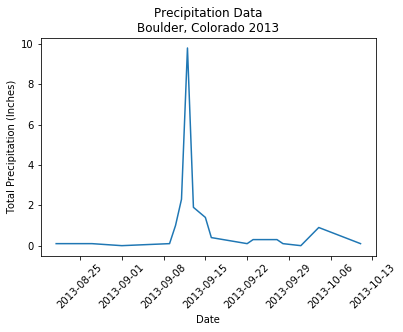
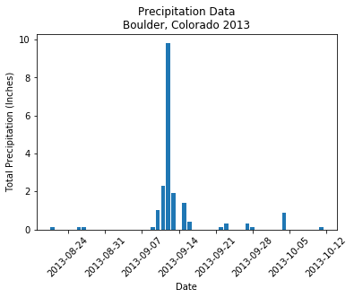




## Get started with date formats in Python

In this tutorial, we will look at the date time format - which is important for
plotting and working with time series data in R.


<div class='notice--success' markdown="1">

## <i class="fa fa-graduation-cap" aria-hidden="true"></i> Learning Objectives

At the end of this activity, you will be able to:

* Convert column in a dataframe containing dates / times to a date/time object that can be used in Python.
* Be able to describe how we can use the 'date' class to create easier to read time series plots in `Python`.


## <i class="fa fa-check-square-o fa-2" aria-hidden="true"></i> What you need

You need `Python 3.x` and `Jupyter notebooks` to complete this tutorial. Also you should have
an `earth-analytics` directory setup on your computer with a `/data`
directory with it.

* [How to Setup R / RStudio](/course-materials/earth-analytics/week-1/setup-r-rstudio/)
* [Setup your working directory](/course-materials/earth-analytics/week-1/setup-working-directory/)
* [Intro to the R & RStudio Interface](/course-materials/earth-analytics/week-1/intro-to-r-and-rstudio)

</div>


In this tutorial, we will learn how to convert data that contain dates and times
into a date / time format in `Python`. To begin, let's revisit the boulder precip data that we've been working with in this module.


```python
#import earthlab as et
import numpy as np
import pandas as pd
import matplotlib.pyplot as plt
import os
plt.ion()
# be sure to set your working directory\n",
os.chdir("/Users/lewa8222/Documents/earth-analytics/")
```

## Plot using pandas 


```python
boulder_precip = pd.read_csv('data/boulder-precip.csv')
boulder_precip.plot('DATE', 'PRECIP')
```


    <matplotlib.axes._subplots.AxesSubplot at 0x10ad57e48>


## Plot using matplotlib

We can use matplotlib plotting to further customize our plots, so let's use that instead.


```python
fig, ax= plt.subplots()
ax.plot('DATE', 'PRECIP', data=boulder_precip)
plt.setp(ax.get_xticklabels(), rotation=45)
ax.set(xlabel="Date",
       ylabel="Total Precipitation (Inches)",
       title="Precipitation Data\nBoulder, Colorado 2013");
```


    ---------------------------------------------------------------------------

    ValueError                                Traceback (most recent call last)

    <ipython-input-5-07bdf32f1a38> in <module>()
          1 fig, ax= plt.subplots()
    ----> 2 ax.plot('DATE', 'PRECIP', data=boulder_precip)
          3 plt.setp(ax.get_xticklabels(), rotation=45)
          4 ax.set(xlabel="Date",
          5        ylabel="Total Precipitation (Inches)",


    /Users/lewa8222/anaconda/lib/python3.6/site-packages/matplotlib/__init__.py in inner(ax, *args, **kwargs)
       1896                     warnings.warn(msg % (label_namer, func.__name__),
       1897                                   RuntimeWarning, stacklevel=2)
    -> 1898             return func(ax, *args, **kwargs)
       1899         pre_doc = inner.__doc__
       1900         if pre_doc is None:


    /Users/lewa8222/anaconda/lib/python3.6/site-packages/matplotlib/axes/_axes.py in plot(self, *args, **kwargs)
       1405 
       1406         for line in self._get_lines(*args, **kwargs):
    -> 1407             self.add_line(line)
       1408             lines.append(line)
       1409 


    /Users/lewa8222/anaconda/lib/python3.6/site-packages/matplotlib/axes/_base.py in add_line(self, line)
       1791             line.set_clip_path(self.patch)
       1792 
    -> 1793         self._update_line_limits(line)
       1794         if not line.get_label():
       1795             line.set_label('_line%d' % len(self.lines))


    /Users/lewa8222/anaconda/lib/python3.6/site-packages/matplotlib/axes/_base.py in _update_line_limits(self, line)
       1813         Figures out the data limit of the given line, updating self.dataLim.
       1814         """
    -> 1815         path = line.get_path()
       1816         if path.vertices.size == 0:
       1817             return


    /Users/lewa8222/anaconda/lib/python3.6/site-packages/matplotlib/lines.py in get_path(self)
        987         """
        988         if self._invalidy or self._invalidx:
    --> 989             self.recache()
        990         return self._path
        991 


    /Users/lewa8222/anaconda/lib/python3.6/site-packages/matplotlib/lines.py in recache(self, always)
        674                 x = ma.asarray(xconv, np.float_).filled(np.nan)
        675             else:
    --> 676                 x = np.asarray(xconv, np.float_)
        677             x = x.ravel()
        678         else:


    /Users/lewa8222/anaconda/lib/python3.6/site-packages/numpy/core/numeric.py in asarray(a, dtype, order)
        529 
        530     """
    --> 531     return array(a, dtype, copy=False, order=order)
        532 
        533 


    ValueError: could not convert string to float: '2013-10-11'


Notice when we try to plot the data, we get an error - take note of the very last
python error message. 

`ValueError: could not convert string to float: '2013-10-11'`

Let's look closely at the STRUCTURE of the data to understand why Python is not able to plot our data.


```python
# not sure how this maps onto python
boulder_precip.dtypes
```


    Unnamed: 0      int64
    DATE           object
    PRECIP        float64
    dtype: object


Looking at the structure of our data, we see that the DATE field is of type `object`. However ideally we want Python to read this column as a date so we can work with it as a chronological element rather than a string or some other format.

## Python Data types 

The structure results above tell us that the data columns in our `data.frame`
are stored as several different data types or `classes` as follows:

* **int64 - Character:** 64 bit integer. This is a numeric value that will never contain decimal points.
* **object:** what is this??.
* **float64 - 64 bit float:**  This data type accepts data that are a wide variety of numeric formats
including decimals (floating point values) and integers. Numeric also accept
larger numbers than **int** will.

### Data frame columns can only contain one data class

A `data.frame` column can only store on type. This means that a column can not
store both numbers and strings. If a column contains a list of numbers and one
letter, then the entire column will stored as a `chr` (character).

Storing
variables using different `types` is a strategic decision by `Python` (and
other programming languages) that optimizes processing and storage. It allows:

* data to be processed more quickly & efficiently.
* the program (`Python`) to minimize the storage size.

Remember, that we also discussed classes during class in these lessons: [vectors in R - data classes](/course-materials/earth-analytics/week-2/work-with-data-types-r/)

## Dates stored as characters
Note that the Date column in our data.frame is of class object. This
means that Python  is reading dates in as objects rather than dates that
contain a value that is sequential.


```python
boulder_precip.dtypes
```


    dtype('O')


Thus, when we plot, `Python` gets hug up on the Date date. 
We can avoid this problem by explicetly importing our data using a dates argument as follows:

`parse_dates=['columnNameWithDatesHere']`

Let's give it a try


```python
boulder_precip = pd.read_csv('data/boulder-precip.csv',
                             parse_dates=['DATE'])
boulder_precip.dtypes
```


    Unnamed: 0             int64
    DATE          datetime64[ns]
    PRECIP               float64
    dtype: object


This looks much better. now the DATE column is of type: `datetime64`.
Let's try to plot again.


```python
fig, ax= plt.subplots()
ax.plot('DATE', 'PRECIP', data=boulder_precip)
plt.setp(ax.get_xticklabels(), rotation=45)
ax.set(xlabel="Date",
       ylabel="Total Precipitation (Inches)",
       title="Precipitation Data\nBoulder, Colorado 2013");
```





Notice that now our x-axis date values are easier to read as Python 
knows how to only show incremental values rather than each and every date value. We can plot our data as a barplot too.


```python
fig, ax= plt.subplots()
ax.bar(boulder_precip['DATE'].values, boulder_precip['PRECIP'].values)
plt.setp(ax.get_xticklabels(), rotation=45)
ax.set(xlabel="Date",
       ylabel="Total Precipitation (Inches)",
       title="Precipitation Data\nBoulder, Colorado 2013");
```




